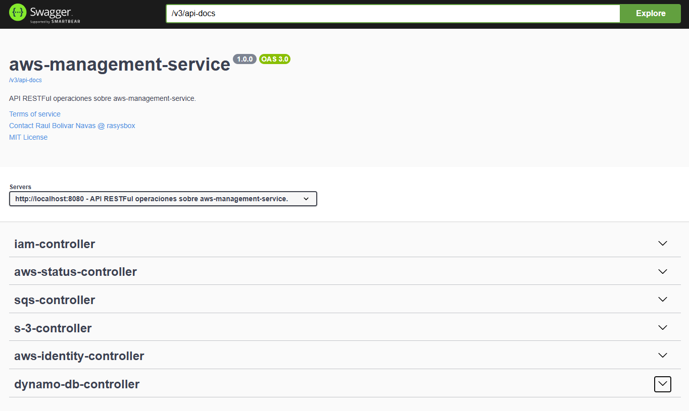

# AWS Management Service

This service provides a set of tools and utilities to manage AWS resources effectively. It includes functionalities for resource management, cost optimization, security compliance, and performance monitoring.

## Overview

## Features

- **Resource Management**: Create, update, and delete AWS resources such as EC2 instances, S3 buckets, and RDS databases.
- **Cost Optimization**: Analyze AWS usage and costs, providing recommendations for savings.
- **Security Compliance**: Ensure AWS resources comply with security best practices and policies.
- **Performance Monitoring**: Monitor the performance of AWS resources and applications, providing insights and alerts.
- **Automation**: Automate routine tasks and workflows using AWS Lambda and Step Functions.
- **Integration**: Integrate with other AWS services and third-party tools for enhanced functionality.
- **User Management**: Manage AWS Identity and Access Management (IAM) users, roles, and policies.
- **Logging and Auditing**: Collect and analyze logs from AWS services for auditing and troubleshooting.
- **Backup and Recovery**: Implement backup strategies for critical AWS resources and ensure data recovery options are in place.
- **Documentation and Support**: Provide comprehensive documentation and support for users to effectively utilize the service.
- **Multi-Region Support**: Manage AWS resources across multiple regions for global applications.
- **Cost Explorer**: Visualize and analyze AWS spending patterns over time.
- **Tagging Strategy**: Implement a tagging strategy for better resource organization and cost allocation.

## Getting Started

To get started with the AWS Management Service, follow these steps:

1. **Set Up AWS Account**: Ensure you have an AWS account with the necessary permissions to manage resources.
2. **Install AWS CLI**: Install the AWS Command Line Interface (CLI) to interact with AWS services from your terminal.
3. **Configure AWS CLI**: Run `aws configure` to set up your AWS credentials and default region.
4. **Explore AWS Management Console**: Log in to the AWS Management Console to access various services and tools.
5. **Review Documentation**: Familiarize yourself with the service documentation to understand available features and best practices.
6. **Start Managing Resources**: Use the AWS Management Service to create, update, and manage your AWS resources effectively.
7. **Monitor and Optimize**: Regularly monitor your AWS resources and costs, applying optimizations as needed.
8. **Implement Security Best Practices**: Ensure your AWS resources are secure by following recommended security practices and compliance guidelines.

## Contributing

We welcome contributions to the AWS Management Service. If you have ideas for new features, improvements, or bug fixes, please follow these steps:

1. **Fork the Repository**: Create a fork of this repository on GitHub.
2. **Create a Branch**: Create a new branch for your feature or bug fix.
3. **Make Changes**: Implement your changes and ensure they adhere to the project's coding standards.
4. **Test Your Changes**: Run tests to ensure your changes do not break existing functionality.
5. **Submit a Pull Request**: Submit a pull request with a clear description of your changes and the problem they solve.

## License

This project is licensed under the MIT License. See the [LICENSE](LICENSE) file for details.

## Contact

For any questions, feedback, or support requests, please contact the AWS Management Service team at [

[Raul Bolivar Navas](mailto:rasysbox@hotmail.com) or visit our [GitHub repository](https://github.com/raulrobinson/fullstack-aws-localstack/blob/main/aws-management-service).

## Acknowledgments
We would like to acknowledge the contributions of the open-source community and AWS for providing the tools and services that make this project possible. Special thanks to all contributors who have helped improve the AWS Management Service.

